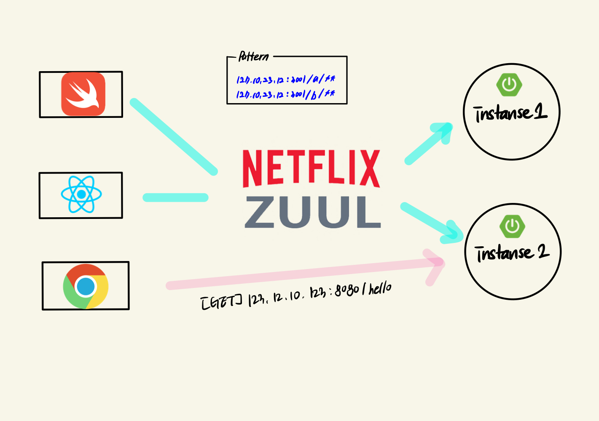

# Spring Netflix Zuul
> netflix zuul 프로젝트도 spring cloud 에 속한 프로젝트이다.  
> spring netflix zuul은 2018 말에 maintenance mode로 전환 되었습니다.

## 등장배경

iOS를 쓰는 `clientA`가 `http://123.234.123.12:8080/hi` 라는 `A 마이크로서비스`로 직접 요청을 보내고 `Web`을 쓰는 `clientB`가 `http://123.422.123.42:8081/hi` 라는 `B 마이크로서비스`로 요청을 직접 보낸다고 할 때 마이크로서비스 API URI가 변경될 때마다 Client Side의 코드도 변경되게 된다.

API URI 변경에 많은 client side application이 변경되면 안되기 때문에 중앙에서 관리해줄수 있는 API Gateway가 필요하다.

## Zuul

API Gateway 역할을 해주는 Netflix Zuul이라는 라이브러리를 사용하게 되는데..  
작동원리와 흐름은 아래와 같다. (maintenance mode 로 springboot 2.3.x 사용해야 함)



미리 Zuul 애플리케이션 Rotues 설정을 해둔다. 

```yml
zuul: 
    routes: 
        first-service:
            path: /first-service/**
            url: http://localhost:8080/
        second-service:
            path: /second-service/**
            url: http://localhost:8081/
```
