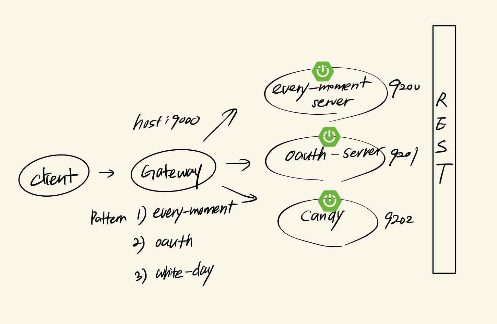
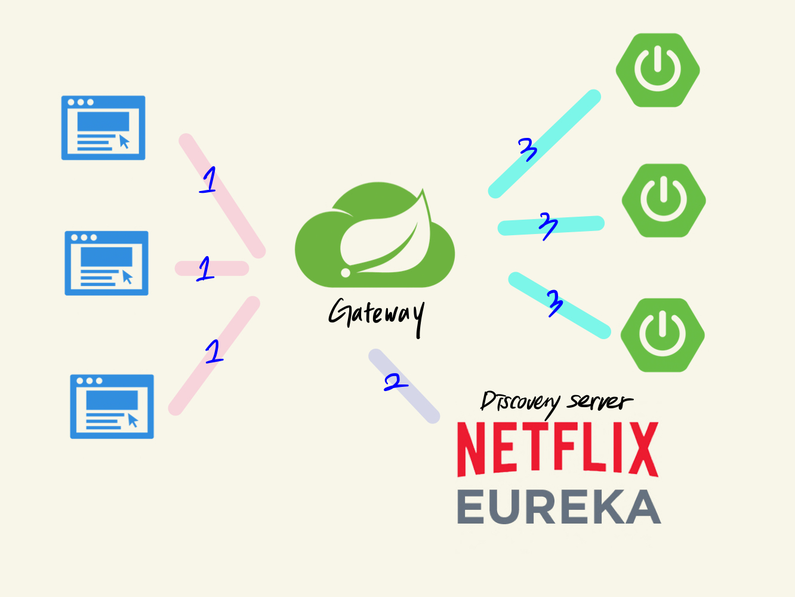
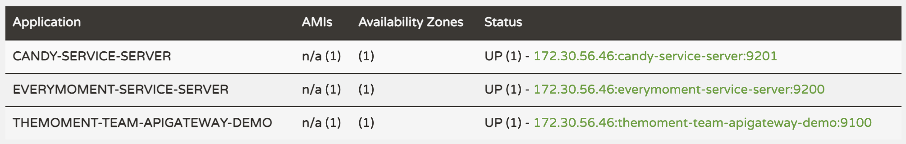

# Spring Cloud Gateway
> [spring cloud gateway 공식문서](https://cloud.spring.io/spring-cloud-gateway/reference/html/)

## spring cloud gateway 란?

Spring Cloud Gateway는 API로 라우팅하는 간단하면서도 효과적인 방법을 제공하고 보안, 모니터링/메트릭 및 탄력성과 같은 교차 문제를 API에 제공하는 것을 목표로 합니다.

다양한 부가 기능은 공식문서를 참고하자.

## api uri pattern을 통해 routing 하기

대충 아래와 같은 구조로 설계할 수 있다.

<p align="center">
    
</p>

`every-moment server`가 `http://localhost:9000/every-moment/`를 base uri 로 가질 때.  
gateway에 등록할 패턴(path)은 `/every-moment`가 되는 것이다.

yml로 설정할 수 있지만, 확장성과 유지보수를 생각해서 POJO `@Configuration`을 이용하는 것이 바람직하다.

```java
/**
 * every-moment service gateway config
 */
@Configuration
public class EveryMomentGatewayFilterConfig {

    @Bean
    public RouteLocator everyMomentGatewayRoutes(RouteLocatorBuilder builder){
        return builder.routes()
                .route(
                        r -> r.path("/every-moment/**") // path pattern
                                .filters(
                                        f -> f.addRequestHeader("reverse-proxy", "EveryMoment-gateway-sever")
                                                .addResponseHeader("response-server", "EveryMoment-service-server")
                                )
                                .uri("http://localhost:9200/")
                ).build();
    }

}
```

여기서 `.fiter()`의 역할은 요청 전에 `.addRequestHeader()` 해주는 역할을 수행한다.  
이를 통해 얻을 수 있는 이점은. `client-service-server`(real server)가 요청을 받을 때 gateway에서 추가하는 http header 가 있는 요청에 대해서만 처리하게 할 수 있다. (request white list)

> header 가 존재하지 않는다면. 정상적인 경로에서 온 요청이 아니라는 것  
> 아래와 같이 Bad Request로 response 하게 된다.
> 
> ```
> 
> ```

## Eureka server(Discovery-server) 와 함께 사용하기

대략적으로 아래와 같이 구성할 수 있다.

<p align="center">
    
</p>

1. client에서 gateway uri로 요청을 한다.
2. gateway는 eureka server에 client 요청을 전달하고.
3. eureka server는 해당 요청에 알맞는 applicaiton-server를 찾는다.
4. 최종적으로 application server에 요청이 정상적으로 도착하게 된다.


### application 설정하기

1. Enable Eureka server
```yml
server:
  port: 8761 # default eureka server port

spring:
  application:
    name: discovery-server

# discovery server 는 자기 자신이 등록되면 안된다.
eureka:
  client:
    register-with-eureka: false
    fetch-registry: false
```

2. (client) application server
```yml
server:
  port: 0 # or what you want.

spring:
  application:
    name: candy-service-server

eureka:
  client:
    fetch-registry: true
    register-with-eureka: true
    service-url:
      defaultZone: http://localhost:8761/eureka
```

`defaultZone`에 해당하는 discovery-server uri로 eureka client server를 등록한다.

3. all application run
> 모든 애플리케이션들을 시작하면 eureka server dashboard 에는 아래와 같이 표시 될 것이다.

<p align="center">
    
</p>

### gateway 설정하기
아까 gateway에 설정했던 Filter 클래스를 조금 변경해주면 된다.

```java
/**
 * every-moment service gateway config
 */
@Configuration
public class EveryMomentGatewayFilterConfig {

    @Bean
    public RouteLocator everyMomentGatewayRoutes(RouteLocatorBuilder builder){
        return builder.routes()
                .route(
                        .... // 생략
                        .uri("lb://APPLICATION-NAME") // lb:// + eureka client application name
                ).build();
    }
}
```