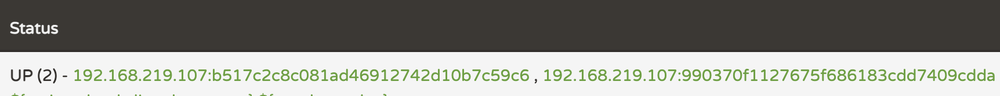

# Spring Cloud Netflix
> https://spring.io/projects/spring-cloud-netflix

## 서론

Netflix는 2007년 심각한 DB 손상으로 3일간 서비스 장애를 겪었다.  
그래서 Netflix는 신뢰성 높고 수평 확장이 가능한 클라우드 네이티브 시스템으로 이전할 필요성을 느꼈습니다.  
단순히 플랫폼 이전만으로는 기존의 문제점과 한계를 탈피할 수 없다고 판단한 넷플릭스는 고가용성, 유연한 스케일링, 빠르고 쉬운 배포를 위해 MSA를 선택했습니다.

이 과정에서 넷플릭스가 경험한 노하우와 문제해결 방법을 공유하기 위해 MSA 전환기술을 오픈소스로 공개했습니다.  
이렇게 탄생한 Netflix OSS 는 MSA를 도입하려는 많은 사람들에게 좋은 선택지가 되고 있습니다.

[자세한 내용은 여기를 참고](https://www.samsungsds.com/kr/insights/msa_and_netflix.html)

## 서비스 디스커버리 서버 - Eureka

MSA 구조에서 서비스들은 동적으로 확장되고 축소되기도 하는데 이때마다 운영자가 일일이 인스턴스 정보를 수정, 관리하기란 쉬운 일이 아닙니다.  
따라서 인스턴스의 상태를 동적으로 관리하는 서버가 필요해졌는데 이를 보통 서비스 디스커버리 서버로 칭하며 넷플릭스는 Eureka라는 이름으로 공개하였습니다.

Eureka에는 `Eureka server` 와 `Eureka client` 로 나뉘는데  
server가 중앙 관리 센터라고 생각하면 됩니다. server가 client를 구독하는 형식으로 보면 됩니다.  
client 설정 파일에 server의 정보를 입력하고, client 인스턴스가 시작할 때 server에게 자신의 ip, host, port등의 정보를 전송합니다.

운영자들은 설정 파일에 `Eureka server` 정보만 입력하면 되고, 서비스들은 다른 서비스를 호출할 때 `Eureka server`에 등록된 인스턴스를 조회하면 됩니다.

## discovery-server

```
service default port: 8761
```

Eureka server `8761` port로 하지 않으면 Eureka client 에서 connection refuesed error를 던진다.
[참고하세요](https://stackoverflow.com/a/69234230)

### discovery server는 자기 자신을 client 로 등록하면 안된다.

```yml
eureka:
  client:
    register-with-eureka: false
    fetch-registry: false
```

## profile 별 port 다르게 실행하기

```sh
-Dserver.port=9001
```
`-D` 는 옵션을 부여하겠다는 의미이고. 그 옵션은 `server.port`를 `9001`로 하겠다는..!

## random load balancer

```yml
server:
  port: 0
```

같은 애플리케이션을 `scale-out` 해야할 때...  
매번 다른 profile, 옵션으로 관리자가 하나하나 실행시키기에는 리소스가 크다. (추가 설명은 밑에서)  
spring `server.port`를 `0`으로 하게 되면 random으로 포트가 부여된다.

```sh
...
Tomcat initialized with port(s): 0 (http)

...
Tomcat started on port(s): 61169 (http) with context path ''
Updating port to 61169
...
```

이렇게만 설정하면 동적으로 할당된(random load balancing) 포트번호가 Eureka server에 등록되는 것이 아니라.  
spring application 설정에 등록한 `port: 0`이 등록되며 인스턴스를 늘려도 `Availability Zones`은 1개로 감지된다.

```yml
eureka:
  instance:
    instance-id: ${spring.cloud.client.hostname}:${spring.application.instance_id:${random.value}}
```

client server에 이러한 옵션을 주면 아래와 같이 활성화된 2개의 Zone 을 확인할 수 있다.



## 운영에서도 random 포트를 이용하나요?

결론. 서비스 애플리케이션이 사용되어지는 서비스 규모에 따라 다르지만 random 포트를 이용한다고 한다.  
이후 답변 내용에서 k8s 컨테이너 POD 관리에 대한 내용이 나오는데 좀 더 공부하고 정리해 보려 한다.