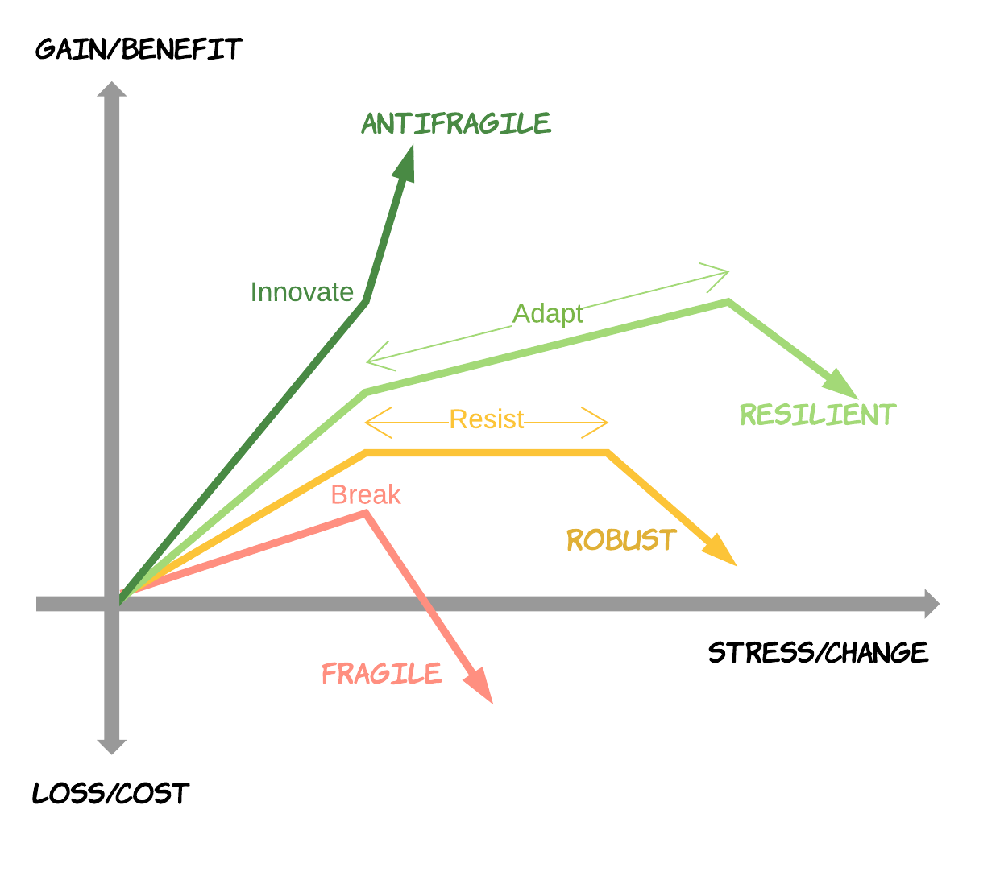

# 소프트웨어 아키텍쳐

## History of IT system 

* 1960 ~ 80s: Fragile, Cowboys
  * Mainframe, Hardware
* 1990 ~ 2000s: Robust, Distributed
  * Changes
* 2010s ~ : Resilient/Anti-Fragile, Cloud Native
  * Flow of value의 지속적인 개선

## Antifragile

* Auto scaling
  * 
* Microservices
* chaos engineering
* Cotinuous deployments

